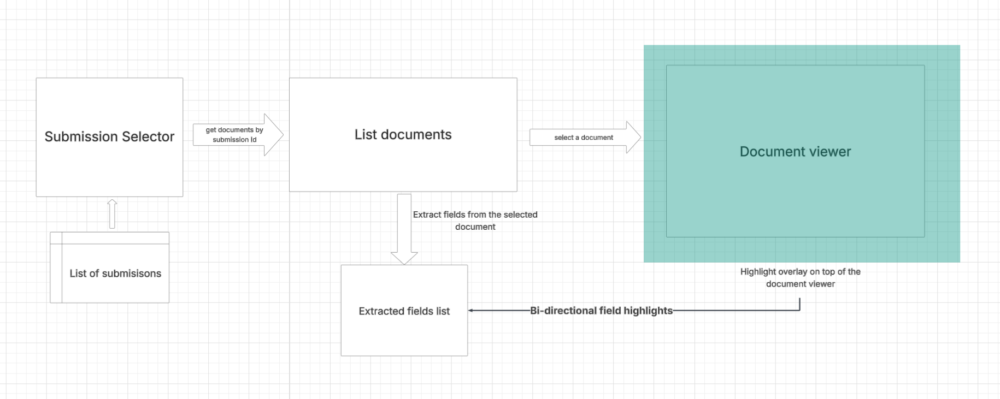

## Design Overview

### 1. Stack Choice
- Framework: Next.js (App Router) + React – SSR/streaming ready, file-based routing, easy static hosting for this prototype.
- TypeScript – Strong typing for field & provenance contracts reduces runtime errors.
- UI: Tailwind (utility-first) + Shadcn UI primitives (Radix) for accessible composable components.
- Document Rendering: react-pdf (pdf.js under the hood), docx-preview for DOCX, xlsx-js-style for spreadsheets.
- State: Lightweight React Context (`HighlightContext`) + URL params (shareable deep links) instead of heavier global store.
- Data: Static JSON manifests + extraction JSON per submission id, simulates backend API with artificial delay.

### 2. Component Diagram

### 3. Data Flow
1. User selects a submission – client loads that submission's document manifest (static JSON).  
2. User selects a document – `DocumentViewer` mounts the appropriate viewer (PDF / DOCX / Sheet).  
3. Extraction data – `loadExtractionData(submissionId)` fetches `/data/extraction_<id>.json` and returns `ExtractionData` (fields and metadata).  
4. `FieldList` renders the extracted fields.  
5. `HighlightContext` broadcasts the currently highlighted `ExtractedField` to both the viewer and the field list (bi-directional sync if a highlight is triggered inside the document pane).  
6. User makes corrections to field values, which are stored in **localStorage** against the corresponding **submission ID**.  
7. URL state sync – `useSelectionUrlState` reads/writes `submissionId`, `documentId`, and `page` query params, managing state to enable deep-link and back/forward consistency.  
8. Viewer resolves provenance to visual coordinates:  
   - **PDF/DOCX**: normalized `[x,y,w,h]`.  
   - **XLSX**: `[row,col,rowSpan,colSpan]` converted via cumulative row/col widths & heights to normalized box.  
9. `HighlightOverlay` renders positioned highlight(s) and clears them after TTL (2s) unless re-triggered.  

### 4. UI Architecture

Purpose for each UI component:

Core Orchestration
- `DocumentViewer` – Central hub that selects and mounts the correct viewer (PDF, DOCX, XLSX, Image( not implemented), Email ( not implemented)) and surfaces unified loading/error states & highlight routing.
- `SideMenu` – Left panel shell that holds document navigation controls.
- `SubmissionSelector` – Dropdown/selector to choose the active submission context (drives document and extraction data).
- `DocumentList` – Lists all documents for the currently selected submission.
- `FieldList` – Renders extracted fields with inline editing, provenance linkage, and modified state indicators.

Field Editing & Highlighting
- `FieldCard` – Container for a single field row managing editing & highlight triggers.
- `FieldCardHeader` – Displays the field label / name and status adornments.
- `FieldCardValue` – Inline editable value cell with debounce + cancel/confirm behaviors.
- `HighlightOverlay` – Absolutely positioned layer on the document rendered container with highlights.

PDF Viewer Suite (`/PdfViewer`)
- `PdfViewer` – Coordinates PDF loading, page navigation, and extracted field highlight projection (Using  `HighlightOverlay`).
- `PdfDocument` – Loads the PDF and reports page count (thin abstraction over react‑pdf document load).
- `PdfCarousel` – Manages horizontal/scrollable page viewport & pagination state sync.
- `PdfPage` – Renders an individual PDF page canvas.
- `PdfHeader` – Toolbar for PDF (page indicators, navigation, download, retry logic ).

DOCX Viewer Suite (`/DocxViewer`)
- `DocxViewer` – Fetches, renders, and paginates a DOCX file into pages.
- `Header` (`DocxViewerHeader`) – Toolbar with page info, retry, and download actions.
- `PageCarousel` – Carousel wrapper enabling horizontal page navigation.
- `PageMount` – Mount point wrapper responsible for correct sizing/containment of a rendered page.
- `PageSlide` – Renders `PageMount` with highlight overlay  (Using  `HighlightOverlay`).

Sheet Viewer Suite (`/SheetViewer`)
- `SheetViewer` – Loads workbook, manages sheet pagination, and field mapping to cell ranges.
- `SheetToolbar` – Sheet-level actions: navigation, retry, download metadata display.
- `SheetTable` – Renders a single sheet (cells grid) with highlight interactions.

Other Viewers
- `ImageViewer` – Just a placeholder (not implemented).
- `EmailViewer` – Just a placeholder (not implemented).

Error & Skeleton States
- `DocumentViewerError` – Unified retry-capable error panel for any viewer load failure.
- `DocumentViewerSkeleton` – Loading skeleton while resolving document loading state.
- `SideMenuSkeleton` – Loading skeleton for side navigation (submission & document lists).
- `FieldListViewerSkeleton` - Loading skeleton for field list pane.

Shared UI Primitives (`/components/ui`) – exported from and wrapped Radix / shadcn primitives.
- `button`, `badge`, `card`, `select`, `separator`, `skeleton`, `sheet`, `tooltip`, `carousel`, `scroll-area`, `resizable`, `input` – Consistent, accessible building blocks with Tailwind theming.

Supporting Utilities (Context / Hooks – referenced by components)
- `HighlightContext`  – Provides highlight set function & current highlight state to document viewers and field list.
- `useSelectionUrlState` – Syncs submission, document, and page parameters with the URL for deep links and navigation cohesion.

### 5. Provenance Overlay
- Each `ExtractedField` includes: `docId`, `documentType`, `page`, `bbox?` OR `cellRange?` and optional text `snippet`.
- For sheets: `ExcelCellRange = [row, col, rowSpan, colSpan]`, widths/heights arrays accumulate to compute absolute pixel rectangles, then normalized.
- Scroll Sync: overlay container listens to scroll and applies inverse translate to keep highlight alignment.
- Accessibility: Each box is focusable (`role=button`, keyboard Enter/Space triggers highlight) and adds ARIA labels.

### 6. Math behind the provenance overlay
PDF / DOCX:
- Each highlight gives a normalized box `[x, y, w, h]` where values are fractions of the page size (0 → left/top edge, 1 → right/bottom edge).
- To set it on the overlay it is just to multiply by 100 and set CSS: `left = x*100%`, `width = w*100%`.

XLSX Sheets:
- We get a cell range `[row, col, rowSpan, colSpan]` (like saying: start at row 4, column 2, spanning 2 rows × 3 columns).
- We have arrays of actual pixel widths for columns and pixel heights for rows.
- X offset = sum of widths of all columns before `col`.
- Y offset = sum of heights of all rows before `row`.
- Box width = sum of widths of the `colSpan` columns, box height = sum of heights of the `rowSpan` rows.
- Normalize: `normalizedX = xOffset / totalTableWidth` giving values 0–1 just like PDFs.

### 7. AI: Help, Hurt, Validation
#### AI Help
- Assisted with **auto-completion** when creating components and deriving logic.  
- Helped in implementing the **Docx preview**, especially when documentation was limited—prompting AI guided me toward a working solution.  
- Supported understanding of **provenance math**, which helped in the idea of creating a **generic overlay component** that accepts properties to calculate bounding boxes for different document types.  
- Aided in **restructuring components**, breaking them into smaller subcomponents, and refactoring for better organization.  

#### AI Hurt
- **Auto-completion traps**: At times, auto-complete led me in the wrong direction; tabbing through suggestions caused errors that took time to debug.  
- **Obsolete solution**: For rendering PDFs, AI suggested a package that was outdated and had a security vulnerability. This was not flagged, so I had to research alternatives myself and switch to a safer, actively maintained package.

#### Validation
- Validated by **connecting individual pieces** together and testing the complete data flow across components.  
- Used **step-by-step logging and debugging** to confirm which components were rendered and what the data state was at each point.  
- Cross-checked the **bounding box overlay calculations** across different document types to ensure consistency.  
 

### 8. Trade-offs 
- **Client-side rendering**: Rendering documents directly in the browser is a heavy lift and can negatively impact performance when dealing with hundreds of attachments.  
- **Resource limitations**: Browser workers are not as powerful as backend servers, so offloading heavy processing to the backend can improve performance.  
- **Large packages**: Libraries for rendering formats like XLSX and DOCX are memory-intensive, which increases load time and processing cost on the client side.  

### 9. Next Steps / Enhancements
- **Excel formatting**: While various techniques can improve formatting, the ideal solution is serving the file through a URL and loading it inside an iframe. This approach offloads heavy processing from the UI.  
- **Extended field list**:  
  - Add a **delete field** option.  
  - Add a **disabled state** where users cannot edit certain fields.  
  - Support **sorting fields** by provenance or other factors such as frequency of occurrence.
  - Grouping **fields** by Page.
- Adding additional appearance themes to the application.
- **Zoom and panning**: Enable zooming and panning in the document viewer to allow users to validate fields more clearly by inspecting finer details.  

### References
- URL state  - https://medium.com/@roman_j/mastering-state-in-next-js-app-router-with-url-query-parameters-a-practical-guide-03939921d09c
- Shadcn UI  - https://ui.shadcn.com/docs/components
- Usage of react-pdf examples - https://codesandbox.io/examples/package/react-pdf
- Understanding bbox usage in react - https://github.com/alx/react-bounding-box

